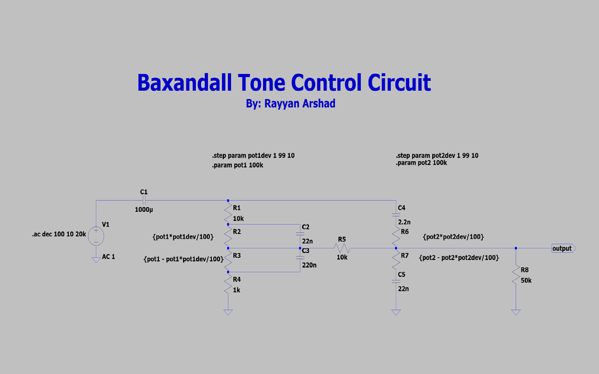

# Baxandall Tone Control Circuit
*Skills: Simulation, Gain Response, Potentiometer, Transfer Function*

## Overview

The Baxandall Tone Control shapes the tone of an audio signal by splitting it into a low-pass "bass" path and a high-pass "treble" path, then mixing the two back together at the output. I built this after working through n-th order low-pass filters in ECEN 214 — I wanted to see what happens when you combine an LPF and HPF into one network instead of treating them separately, since that's closer to how tone controls actually work in real audio gear.

What makes this circuit interesting is that it doesn't isolate frequencies so much as *reshape* the balance between them. Turning the "bass" pot doesn't add bass — it changes how much of the low end gets attenuated relative to everything else. That's a different way of thinking about filtering than the strict pass/reject filters I'd seen in coursework, and it took a bit of a mental shift to model correctly.

## Takeaways

LTspice doesn't have a built-in potentiometer, so I modeled one using two resistors driven by a shared parameter, swept with `.step` to simulate turning the knob from 1% to 99%. Getting the resistor expressions right — one side increasing while the other decreases proportionally — took some trial and error before the sweep actually behaved like a real pot.

The most useful mistake I made was writing `10k` instead of `10` in one of the step values. LTspice read the `k` as a ×1000 multiplier even inside that expression, which quietly blew up the resistance and distorted the whole frequency response until I caught it. It was a good reminder that LTspice's unit suffixes apply everywhere, not just in component value fields — worth double-checking anywhere you're doing math inside an expression.

Working through this gave me a much better intuition for how LPF and HPF sections interact when combined, and how a parameter sweep on a bode plot can make that trade-off visible directly instead of just something I could describe in theory.

---
See [analysis.md](analysis.md) for the bode plot and corner frequency breakdown.
